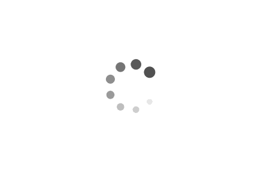

### Progress Indicators

In this repository I'm going to show how to create some progress indicators in react native using the `Animated` API from react native. Here are the list of the indicators that are going to be implemented in this repository.

1. Indeterminate
2. Ripple
3. Circular
4. DotCircular
5. QuaterCircular
6. DoubleCircular
7. BoxIndicator
8. LinearProgress
9. LinearCircularOpacity

<p align="center">
  
</p>

### Indeterminate Indicator

The code for creating an `indeterminate` indicator component is as follows:

```ts
import { View, Animated } from "react-native";
import React from "react";

const Indeterminate = () => {
  const indicatorAnimation = React.useRef(new Animated.Value(0)).current;
  React.useEffect(() => {
    Animated.loop(
      Animated.timing(indicatorAnimation, {
        toValue: 1,
        delay: 0,
        duration: 2000,
        useNativeDriver: false,
      })
    ).start();
  }, []);

  const translateX = indicatorAnimation.interpolate({
    inputRange: [0, 1],
    outputRange: [-500, 500],
  });
  return (
    <View
      style={{
        width: 500,
        flexDirection: "column",
        backgroundColor: "#f5f5f5",
        borderRadius: 999,
        paddingVertical: 3,
        paddingHorizontal: 10,
        overflow: "hidden",
      }}
    >
      <Animated.View
        style={{
          backgroundColor: "cornflowerblue",
          width: "30%",
          height: 10,
          transform: [{ translateX }],
          position: "absolute",
          borderRadius: 10,
        }}
      />
    </View>
  );
};

export default Indeterminate;
```

Preview:

<p align="center">
  
</p>

### Ripple

The code for creating an `ripple` indicator component is as follows:

```ts
import { Animated } from "react-native";
import React from "react";

const Ripple = () => {
  const indicatorAnimation = React.useRef(new Animated.Value(0)).current;
  React.useEffect(() => {
    Animated.loop(
      Animated.timing(indicatorAnimation, {
        toValue: 1,
        delay: 0,
        duration: 1000,
        useNativeDriver: false,
      })
    ).start();
  }, []);
  const scale = indicatorAnimation.interpolate({
    inputRange: [0, 1],
    outputRange: [0, 2],
  });
  return (
    <Animated.View
      style={{
        backgroundColor: "cornflowerblue",
        width: 20,
        height: 20,
        transform: [{ scale }],
        position: "absolute",
        borderRadius: 20,
      }}
    />
  );
};

export default Ripple;
```

Preview:

<p align="center">
  
</p>

### Circular

The code for creating an `circular` indicator component is as follows:

```ts
import { Animated } from "react-native";
import React from "react";

const Circular = () => {
  const indicatorAnimation = React.useRef(new Animated.Value(0)).current;
  React.useEffect(() => {
    Animated.loop(
      Animated.timing(indicatorAnimation, {
        toValue: 1,
        delay: 0,
        duration: 1000,
        useNativeDriver: false,
      })
    ).start();
  }, []);
  const rotate = indicatorAnimation.interpolate({
    inputRange: [0, 1],
    outputRange: ["0deg", "360deg"],
  });
  return (
    <Animated.View
      style={{
        borderColor: "#f5f5f5",
        borderBottomColor: "cornflowerblue",
        width: 40,
        height: 40,
        transform: [{ rotate }],
        borderRadius: 40,
        borderWidth: 3,
      }}
    />
  );
};

export default Circular;
```

Preview:

<p align="center">
  
</p>

### DotCircular

The code for creating an `dot-circular` progress indicator component is as follows:

```ts
import { Animated, View } from "react-native";
import React from "react";

const DotCircular = () => {
  const indicatorAnimation = React.useRef(new Animated.Value(0)).current;
  React.useEffect(() => {
    Animated.loop(
      Animated.timing(indicatorAnimation, {
        toValue: 1,
        delay: 0,
        duration: 1000,
        useNativeDriver: false,
      })
    ).start();
  }, []);
  const rotate = indicatorAnimation.interpolate({
    inputRange: [0, 1],
    outputRange: ["0deg", "360deg"],
  });
  return (
    <Animated.View
      style={{
        borderColor: "#f5f5f5",
        position: "relative",
        width: 40,
        height: 40,
        transform: [{ rotate }],
        borderRadius: 40,
        borderWidth: 3,
      }}
    >
      <View
        style={{
          position: "absolute",
          width: 8,
          height: 8,
          borderRadius: 8,
          backgroundColor: "cornflowerblue",
          top: 2,
        }}
      />
    </Animated.View>
  );
};

export default DotCircular;
```

Preview:

<p align="center">
  
</p>

### DoubleCircular

The code for creating an `double-circular` progress indicator component is as follows:

```ts
import { Animated } from "react-native";
import React from "react";

const DoubleCircular = () => {
  const indicatorAnimation = React.useRef(new Animated.Value(0)).current;
  React.useEffect(() => {
    Animated.loop(
      Animated.timing(indicatorAnimation, {
        toValue: 1,
        delay: 0,
        duration: 1000,
        useNativeDriver: false,
      })
    ).start();
  }, []);
  const rotate = indicatorAnimation.interpolate({
    inputRange: [0, 1],
    outputRange: ["0deg", "360deg"],
  });
  return (
    <Animated.View
      style={{
        borderColor: "transparent",
        borderTopColor: "cornflowerblue",
        borderBottomColor: "cornflowerblue",
        width: 40,
        height: 40,
        transform: [{ rotate }],
        borderRadius: 40,
        borderWidth: 5,
      }}
    />
  );
};

export default DoubleCircular;
```

Preview:

<p align="center">
  
</p>

### QuaterCircular

The code for creating an `quater-circular` progress indicator component is as follows:

```ts
import { Animated } from "react-native";
import React from "react";

const QuaterCircular = () => {
  const indicatorAnimation = React.useRef(new Animated.Value(0)).current;
  React.useEffect(() => {
    Animated.loop(
      Animated.timing(indicatorAnimation, {
        toValue: 1,
        delay: 0,
        duration: 1000,
        useNativeDriver: false,
      })
    ).start();
  }, []);
  const rotate = indicatorAnimation.interpolate({
    inputRange: [0, 1],
    outputRange: ["0deg", "360deg"],
  });
  return (
    <Animated.View
      style={{
        borderColor: "cornflowerblue",
        borderBottomColor: "#f5f5f5",
        width: 40,
        height: 40,
        transform: [{ rotate }],
        borderRadius: 40,
        borderWidth: 3,
      }}
    />
  );
};

export default QuaterCircular;
```

Preview:

<p align="center">
  
</p>

### BoxIndicator

The code for creating an `box-indicator` progress indicator component is as follows:

```ts
import { Animated, View, StyleSheet } from "react-native";
import React from "react";

const BoxIndicator = () => {
  const indicatorAnimation1 = React.useRef(new Animated.Value(0)).current;
  const indicatorAnimation2 = React.useRef(new Animated.Value(0)).current;
  const indicatorAnimation3 = React.useRef(new Animated.Value(0)).current;
  const indicatorAnimation4 = React.useRef(new Animated.Value(0)).current;
  React.useEffect(() => {
    Animated.loop(
      Animated.timing(indicatorAnimation1, {
        toValue: 1,
        delay: 0,
        duration: 1000,
        useNativeDriver: false,
      })
    ).start();
    Animated.loop(
      Animated.timing(indicatorAnimation2, {
        toValue: 1,
        delay: 1,
        duration: 1000,
        useNativeDriver: false,
      })
    ).start();
    Animated.loop(
      Animated.timing(indicatorAnimation3, {
        toValue: 1,
        delay: 3,
        duration: 1000,
        useNativeDriver: false,
      })
    ).start();
    Animated.loop(
      Animated.timing(indicatorAnimation4, {
        toValue: 1,
        delay: 5,
        duration: 1000,
        useNativeDriver: false,
      })
    ).start();
  }, []);
  const opacity1 = indicatorAnimation1.interpolate({
    inputRange: [0, 1],
    outputRange: [1, 0],
  });
  const opacity2 = indicatorAnimation2.interpolate({
    inputRange: [0, 1],
    outputRange: [1, 0],
  });
  const opacity3 = indicatorAnimation3.interpolate({
    inputRange: [0, 1],
    outputRange: [1, 0],
  });
  const opacity4 = indicatorAnimation4.interpolate({
    inputRange: [0, 1],
    outputRange: [1, 0],
  });
  return (
    <View style={{}}>
      <View style={{ flexDirection: "row" }}>
        <Animated.View style={[styles.box, { opacity: opacity1 }]} />
        <Animated.View style={[styles.box, { opacity: opacity2 }]} />
      </View>
      <View style={{ flexDirection: "row" }}>
        <Animated.View style={[styles.box, { opacity: opacity3 }]} />
        <Animated.View style={[styles.box, { opacity: opacity4 }]} />
      </View>
    </View>
  );
};
export default BoxIndicator;

const styles = StyleSheet.create({
  box: {
    backgroundColor: "cornflowerblue",
    width: 20,
    height: 20,
    borderRadius: 2,
    margin: 2,
  },
});
```

Preview:

<p align="center">
  
</p>

### LinearProgress

The code for creating a `linear` progress indicator component is as follows:

```ts
import { View, Animated, Text } from "react-native";
import React from "react";

interface Props {
  progress: number;
  showProgress?: boolean;
}
const Linear: React.FunctionComponent<Props> = ({ progress, showProgress }) => {
  return (
    <View style={{ alignItems: "center" }}>
      <View
        style={{
          width: 500,
          flexDirection: "column",
          backgroundColor: "#f5f5f5",
          borderRadius: 999,
          // overflow: "hidden",
        }}
      >
        <View
          style={{
            backgroundColor: "cornflowerblue",
            width: `${progress}%`,
            height: 5,
            margin: 1,
            borderRadius: 10,
          }}
        />
      </View>
      {showProgress ? (
        <Text style={{ marginTop: 5, color: "gray" }}>{`${progress}%`}</Text>
      ) : null}
    </View>
  );
};

export default Linear;
```

Preview:

<p align="center">
  
</p>

### LinearCircularOpacity

The code for creating a `linear-circular-opacity` progress indicator component is as follows:

```ts
import { Animated, View, StyleSheet } from "react-native";
import React from "react";

const LinearCircularOpacity = () => {
  const indicatorAnimation1 = React.useRef(new Animated.Value(0)).current;
  const indicatorAnimation2 = React.useRef(new Animated.Value(0)).current;
  const indicatorAnimation3 = React.useRef(new Animated.Value(0)).current;
  React.useEffect(() => {
    Animated.loop(
      Animated.timing(indicatorAnimation1, {
        toValue: 1,
        delay: 1,
        duration: 1000,
        useNativeDriver: false,
      })
    ).start();
    Animated.loop(
      Animated.timing(indicatorAnimation2, {
        toValue: 1,
        delay: 2,
        duration: 1000,
        useNativeDriver: false,
      })
    ).start();
    Animated.loop(
      Animated.timing(indicatorAnimation3, {
        toValue: 1,
        delay: 3,
        duration: 1000,
        useNativeDriver: false,
      })
    ).start();
  }, []);
  const opacity1 = indicatorAnimation1.interpolate({
    inputRange: [0, 1],
    outputRange: [1, 0],
  });
  const opacity2 = indicatorAnimation2.interpolate({
    inputRange: [0, 1],
    outputRange: [1, 0],
  });
  const opacity3 = indicatorAnimation3.interpolate({
    inputRange: [0, 1],
    outputRange: [1, 0],
  });

  return (
    <View style={{}}>
      <View style={{ flexDirection: "row" }}>
        <Animated.View style={[styles.box, { opacity: opacity1 }]} />
        <Animated.View style={[styles.box, { opacity: opacity2 }]} />
        <Animated.View style={[styles.box, { opacity: opacity3 }]} />
      </View>
    </View>
  );
};
export default LinearCircularOpacity;

const styles = StyleSheet.create({
  box: {
    backgroundColor: "cornflowerblue",
    width: 10,
    height: 10,
    borderRadius: 10,
    margin: 2,
  },
});
```

Preview:

<p align="center">
  
</p>

### License

In this repository we are using the `MIT` license which reads as follows.

```
MIT License

Copyright (c) 2022 crispengari

Permission is hereby granted, free of charge, to any person obtaining a copy
of this software and associated documentation files (the "Software"), to deal
in the Software without restriction, including without limitation the rights
to use, copy, modify, merge, publish, distribute, sublicense, and/or sell
copies of the Software, and to permit persons to whom the Software is
furnished to do so, subject to the following conditions:

The above copyright notice and this permission notice shall be included in all
copies or substantial portions of the Software.

THE SOFTWARE IS PROVIDED "AS IS", WITHOUT WARRANTY OF ANY KIND, EXPRESS OR
IMPLIED, INCLUDING BUT NOT LIMITED TO THE WARRANTIES OF MERCHANTABILITY,
FITNESS FOR A PARTICULAR PURPOSE AND NONINFRINGEMENT. IN NO EVENT SHALL THE
AUTHORS OR COPYRIGHT HOLDERS BE LIABLE FOR ANY CLAIM, DAMAGES OR OTHER
LIABILITY, WHETHER IN AN ACTION OF CONTRACT, TORT OR OTHERWISE, ARISING FROM,
OUT OF OR IN CONNECTION WITH THE SOFTWARE OR THE USE OR OTHER DEALINGS IN THE
SOFTWARE.

```
